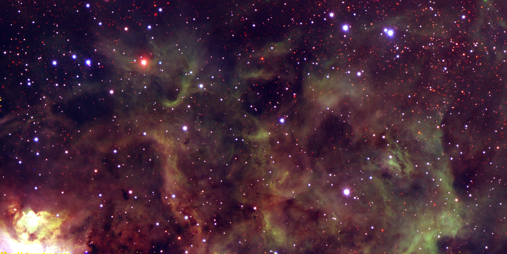
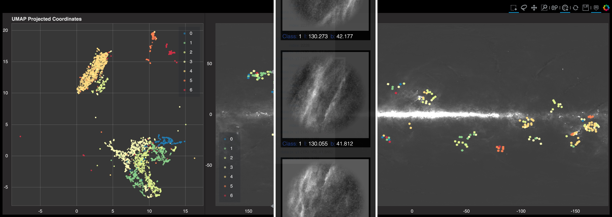
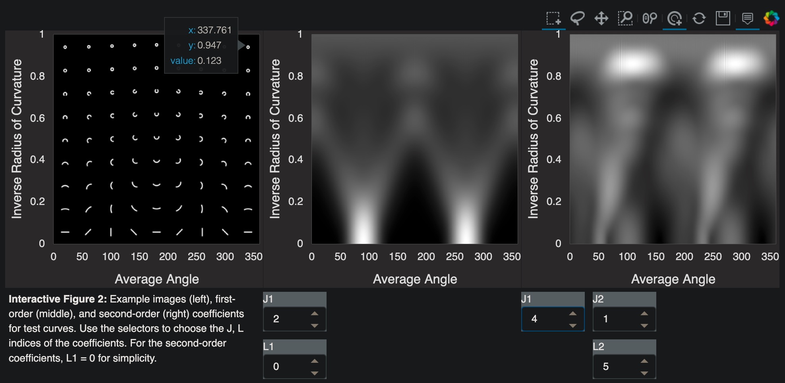
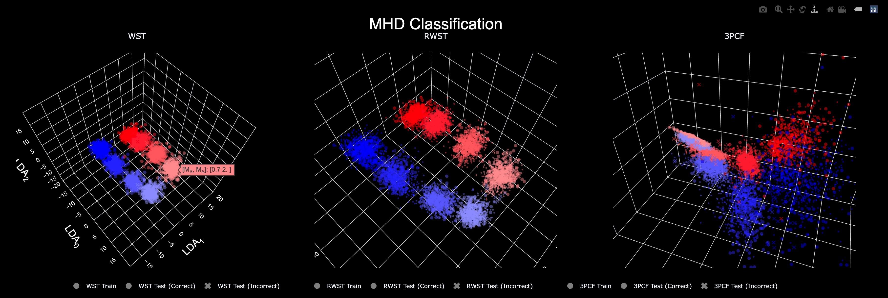

+++

template = "page.html"
title = "Gallery"
[extra]
+++

This is a gallery of some visualizations/plots/images from my work that I am proud of or never really had thier chance to shine. 

## Nebulous Regions in DECaPS2

These are RGB = (zrg - band) images of nebulae in the Dark Energy Camera Plane Survey (DECaPS2) that are examples of the complex images ubiquitous in the Galactic plane that motivated the development of [CloudCovErr.jl](https://github.com/andrew-saydjari/CloudCovErr.jl), an afterburner pipeline to correct the flux and flux uncertainties for stars in the presence of structured backgrounds. Links to higher resolution images are available on the project <a href="http://decaps.skymaps.info/" target="_blank">website</a>.

    

    
    
CED 116, an HII region near the Running Chicken Nebula

    

    

    
    
Cat's Paw Nebula

    

    

    
    
Lobster Nebula

    

    <a class="prev" onclick="plusSlides(-1)">&#10094;</a>
    <a class="next" onclick="plusSlides(1)">&#10095;</a>

 

    
    
    

## UMAP on WISE 12 $\mu$m Dust Map

Unpublished work showing a UMAP representation of images cut from the WISE 12 $\mu$m dust map based on their wavelet scattering transform (WST) coefficients. Hovering over the scatter points visualizes the image on both sides (the UMAP representation and galactic coordinates) of the coupled plot. **Tip**: The image links to an interactive html that is large and can take a few seconds to load.

## APOGEE Detector Frame Residuals

Video of apMADGICS.jl residuals for APOGEE spectra taken at Apache Point Observatory as part of SDSS. Each image is a visit in the detector frame prior to any detector frame artifact component being added to the model. Clear, transient, coherent patterns across both the red and green chips of the detector are apparent. Are they sky line fringing? Internal reflections? I think this sort of data analysis that connects big data stats and detector/experimental physics is fun!

<video width="600" height="600" controls autoplay loop muted>
    <source src="FP_2011_2014_middle_APO.mp4" type="video/mp4">
    Your browser does not support the video tag.
</video>

## Wavelet Scattering Coefficient Explorer

While wavelet scattering coefficients are motivated in part by interpretability, it can be informative (and fun!) to visualize their variation across a smoothly varying family of images, specifically those with properties you are interested in capturing. This plot was made while developing a fast equivariant wavelet scattering coefficient package, [EqWS.jl](https://github.com/andrew-saydjari/EqWS.jl), which is available on Github. **Tip**: The image links to an interactive html that is large and can take a few seconds to load.

## Conditional Gaussian Process Infills 

This movie shows the performance of [CloudCovErr.jl](https://github.com/andrew-saydjari/CloudCovErr.jl) on inpainting masked regions of images of the interstellar medium as a function of the size of the masked region. [CloudCovErr.jl](https://github.com/andrew-saydjari/CloudCovErr.jl) was built to correct photometry of stars for these structured backgrounds and a partner package [CloudClean.jl](https://github.com/andrew-saydjari/CloudClean.jl) was written to focus on producing these statistically accurate reconstructions of the interstellar medium itself. They both leverage an empirical pixel-pixel covariance matrix learned from the image and predict the missing pixels conditional on the pixels that are unmasked. The "draws" in the bottom panel show different realizations of the predicted distribution of infills. Note that hard to reproduce filaments are observed bridging the masked region in several of the draws.

## Latent Space Visualization

At their core, most "machine learning" image classifers (1) compute some usually nonlinear and high dimensional statistics on an image and (2) leverage dimension reduction for compression to seperate classes in a lower dimensional space, a so called "Latent Space." This interactive figure interrogates the differences in the shape of the latent space for various image statistics used in astronomy applied to simple MHD simulations. **Tip**: The image links to an interactive html.

