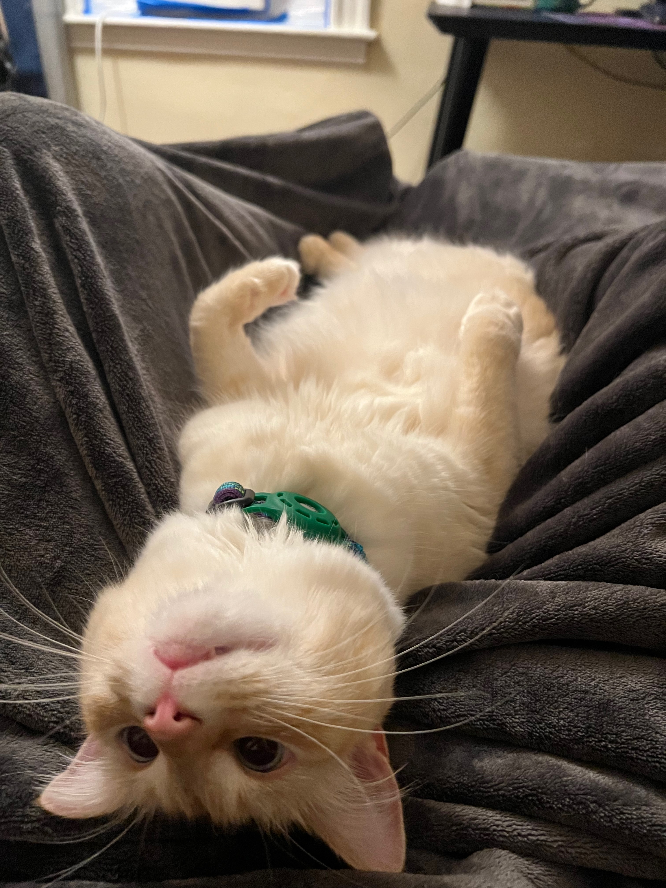
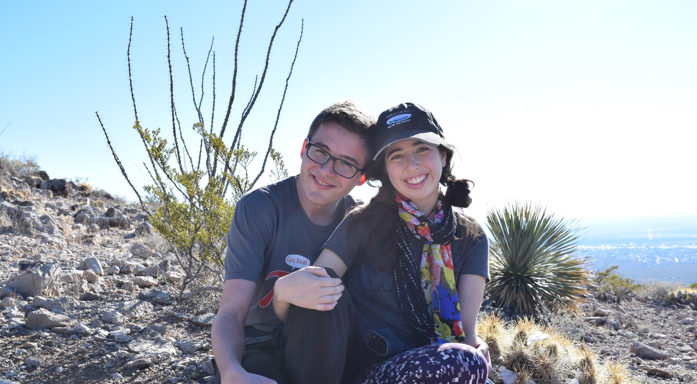
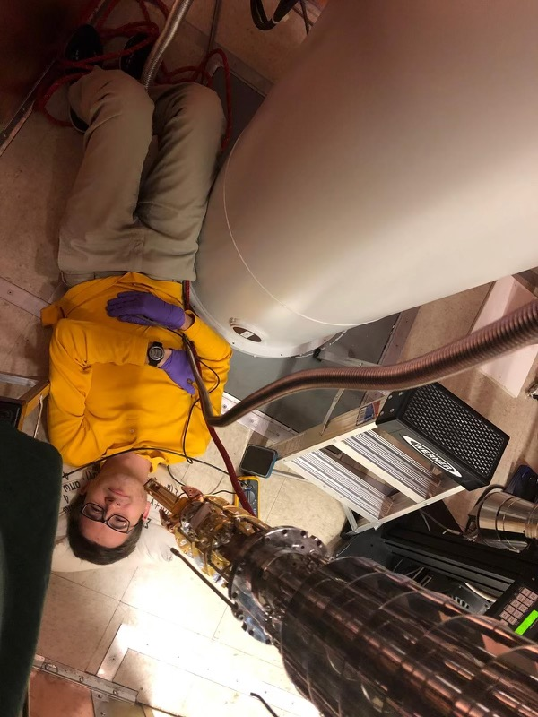
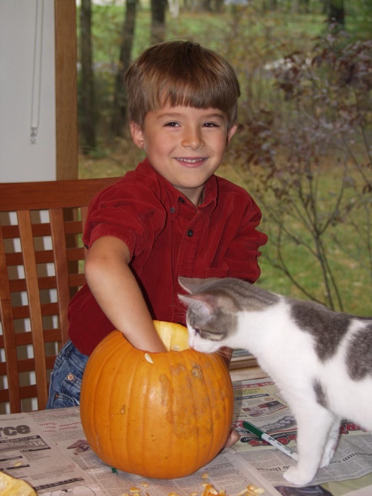

+++

template = "page.html"
title = "Personal"
[extra]
+++

<h3 class="title is-3" id="scicom">
    <a class="has-text-{{ colors::style() }}" href="#/surname">
        Surname
    </a>
</h3>

My last name "Saydjari" is ethnically Syrian and is a transliteration from Arabic of a name indicating that my family originates from <a href="https://en.wikipedia.org/wiki/Shaizar" target="_blank"> Shayzar</a>. I pronounce our spelling as say-JUR-ee.

<h3 class="title is-3" id="scicom">
    <a class="has-text-{{ colors::style() }}" href="#/scicom">
        Science Communication
    </a>
</h3>

For me, one of the main motivations for doing science is my own curiosity, to answer the neverending stream of questions I have about the world around us. I believe it is part of our responsibility to share that knowledge and answer the public's questions as well, working hard to explain without condescension or oversimplificaiton. I find doing so energizing, when you can engage with other people and get them excited about your own obsessions, and centering, reminding me what the big questions are that I am after. To that end, I dabble in popular science writing, some examples of which are on <a href="https://mathstatbites.org/author/andrew-saydjari/" target="_blank">MathStatsBites</a>:  <a href="https://mathstatbites.org/pulling-patterns-out-of-data-with-a-graph/" target="_blank">TheSequencer</a>, <a href="https://mathstatbites.org/bridging-the-gap-between-models-and-data/" target="_blank">CycleStarNet</a>, <a href="https://mathstatbites.org/mathstatbites-at-scma8-astro-image-processing-is-bliss/" target="_blank">SCMA8</a>, <a href="https://mathstatbites.org/combining-nested-sampling-and-normalizing-flows/" target="_blank">NestedSampling</a>.

<h3 class="title is-3" id="Teaching">
    <a class="has-text-{{ colors::style() }}" href="#/Teaching">
        Teaching
    </a>
</h3>

I am passionate about teaching and enjoy developing new materials to explain hard concepts. I love seeing a concept “click” when an explaination works best for a given student’s understanding. My favorite part about teaching is 1-1 student interaction, which feels like the most concrete way I can improve the climate and culture of academia, by lifting up one student at a time. I believe that getting to know students as people is the best way to understand and resolve conceptual gaps. And of course, every time I teach a concept I learn something myself either from great student questions or in the course of refining and improving examples or analogies.

Notes from some Splash/Sprout classes I taught at Yale: 
<a href="OriginsOfLife.pdf" target="_blank">Origins of Life: A Chemist's Perspective</a>,  <a href="AbstractAlgebra.pdf" target="_blank">Abstract Algebra: Questions Teachers Refused to Answer in High School</a>, <a href="DestressingTensors.pdf" target="_blank">Destressing Tensors</a>, <a href="MetalMania.pdf" target="_blank">Metal Mania: Simple Models of the Material World</a>, and <a href="SolarCells.pdf" target="_blank">Peeling Back the Layers of Solar Cells</a>.

Notebooks from "Intro to Python" classes I made for the Latino Initative Program: <a href="https://faun.rc.fas.harvard.edu/saydjari/ExternalShares/LIP/ML/" target="_blank">Introduction to Machine Learning in Astronomy</a> and <a href="https://faun.rc.fas.harvard.edu/saydjari/ExternalShares/LIP/Environments/" target="_blank">Environments, Package Managers, and IDEs</a>

Reviews from TF-ing Solid State I (PHYS 195A): [here](/files/PHYS195A_Reviews.pdf).

<h3 class="title is-3" id="edi">
    <a class="has-text-{{ colors::style() }}" href="#/EDI">
        Equity, Diversity, and Inclusion
    </a>
</h3>

To succeed in the scientific endeavor, we must engage, empower, and retain those long-excluded from the professional astronomy community. I acknowledge the past explicit and implicit exclusion of marginalized individuals and I am committed to enabling equitable access to research and resources. Further, I am committed to continually educating myself in matters of equity and inclusion and to use my privilege and power to uplift and empower. Please see my <a href="/files/saydjari_dei_intro.pdf" target="_blank">EDI philosphy statement</a> for more.

<h3 class="title is-3" id="bio">
    <a class="has-text-{{ colors::style() }}" href="#/bio">
        Short Biography
    </a>
</h3>

    

    
    
Observing with my favorite instrument, DECam

    

    

    
    
Sol R. Flare relaxing

    

    

    
    
Hike with Sophia Sánchez-Maes in Las Cruces, NM

    

    

    
    
Mounting a device on the MX400 dilution refrigerator

    

    

    
    
Tigger Lightning Mischief enjoying Halloween in WI (and me)

    

    <a class="prev" onclick="plusSlides(-1)">&#10094;</a>
    <a class="next" onclick="plusSlides(1)">&#10095;</a>

 

    
    
    
    
    

I was raised in <a href="https://www.wirapids.org/" target="_blank">Wisconsin Rapids, WI</a>, a small midwestern town with kind people and my loving cat. During my time at <a href="https://www.wrps.org/schools/lincoln/" target="_blank">Lincoln High School</a> I became enamored with chemistry and started spending my summers researching at the <a href="https://www.nrl.navy.mil/" target="_blank">US Naval Research Lab</a> working on photosensitive polymers and spectro-electrochemistry with <a href="https://www.linkedin.com/in/blake-simpkins-07a4566/" target="_blank">Blake Simpkins</a> and <a href="https://www.linkedin.com/in/walter-dressick-b9b1a32a/" target="_blank">Walter Dressick</a>. After graduating in 2014, I went to <a href="https://www.yale.edu/" target="_blank">Yale</a> where I immersed myself in the chemistry curriculum and studied <a href="https://thz.yale.edu/" target="_blank">terahertz pump-probe spectroscopy</a>. I spent productive summers working on polymer chemistry for origins-of-life at the <a href="https://centerforchemicalevolution.com/" target="_blank">Center for Chemical Evolution</a>, Georgia Tech and solar cells at <a href="https://www.mpip-mainz.mpg.de/en/home" target="_blank">MPIP</a> in Mainz, Germany. During undergrad was the first time I saw the beauty of mathematics and realized that condensed matter physics was like taking the infinite limit of chemistry. As it happens, Yale also introduced me to another kind of beauty, <a href="https://astronomy.fas.harvard.edu/people/sophia-sanchez-maes" target="_blank">my partner</a>. We bonded over shared curiosity and short-stories (like <a href="https://clarkesworldmagazine.com/kritzer_01_15/" target="_blank">Cat Pictures Please</a>). 

In 2018, I completed my Bachelor of Science with Honors in Mathematics, and dual Bachelor/Master of Science in Chemistry with a thesis on <a href="https://pubs.acs.org/doi/10.1021/acscatal.9b00566" target="_blank">organometallic catalysis</a>. I also completed a thesis in Physics on fabrication of suspended Josephson junctions, advised by <a href="https://appliedphysics.yale.edu/michel-devoret" target="_blank">Michel Devoret</a>. Spurred by this work, I started my graduate studies in the <a href="https://www.physics.harvard.edu/" target="_blank">Department of Physics</a> at <a href="https://www.harvard.edu/" target="_blank">Harvard</a> as a <a href="https://www.nsf.gov/funding/opportunities/grfp-nsf-graduate-research-fellowship-program" target="_blank">NSF Graduate Research Fellow</a>. My first two years, I worked on topological superconductivity in superconductor-semiconductor Josephson junctions, which involved some awesome lithography, fabricating devices on InAs and HgCdTe, and running a dilution refrigerator. Some pandemic induced reflection, deep concerns about the condensed matter <a href="https://virtualscienceforum.org/reproducibility_in_cmp/" target="_blank">replicability crisis</a>, and inspiration from my partner led me to astrophysics. 

During that time, I realized my favorite days were the ones where I spent all day playing with data, trying to understand how to best model and visualize it, and that is what I do every day now! My thesis "Statistical Models of the Spatial and Chemical Complexity of Dust" (2024) advised by <a href="https://astronomy.fas.harvard.edu/people/douglas-finkbeiner" target="_blank">Douglas Finkbeiner</a> united all of my passions. I develop mathematical and statistical models for rigorous inference on large spectroscopic (and imaging) surveys in order to study the chemistry of interstellar dust, making interactive visualizations and "hot plots" along the way.

Outside of work, I enjoy biking, fantasy and science fiction audiobooks, and curling up with my cat. I am a member of several fandoms and strongly believe that Voyager is the best Star Trek series.
